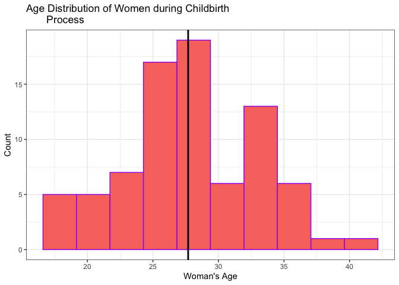
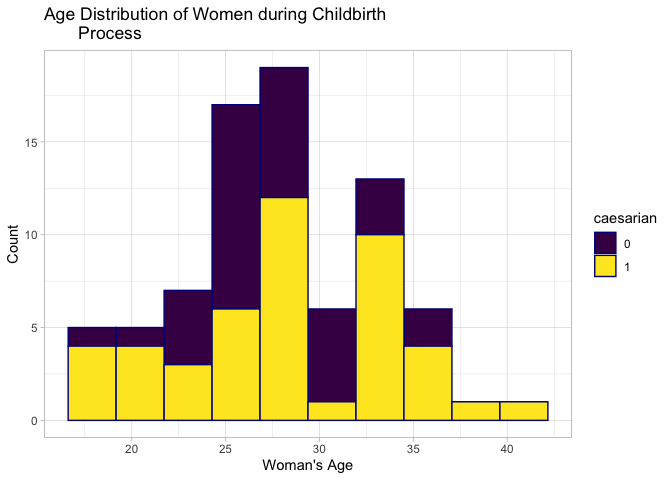
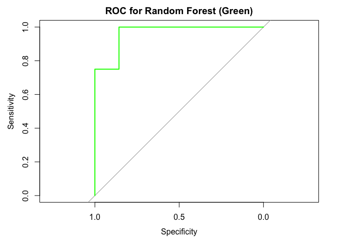

Predicting Caesarian Births
================

-   <a href="#status-continuing-working-document"
    id="toc-status-continuing-working-document">Status: Continuing Working
    Document</a>
-   <a href="#introduction" id="toc-introduction">Introduction</a>
-   <a href="#loading-the-libraries" id="toc-loading-the-libraries">Loading
    the Libraries</a>
-   <a href="#loading-the-data" id="toc-loading-the-data">Loading the
    Data</a>
-   <a href="#cleaning-the-data" id="toc-cleaning-the-data">Cleaning the
    Data</a>
-   <a href="#exploratory-data-analysis"
    id="toc-exploratory-data-analysis">Exploratory Data Analysis</a>
-   <a href="#modeling-random-forests"
    id="toc-modeling-random-forests">Modeling: Random Forests</a>
    -   <a href="#applications" id="toc-applications">Applications</a>
    -   <a href="#pros" id="toc-pros">Pros</a>
    -   <a href="#cons" id="toc-cons">Cons</a>
-   <a href="#modeling-binary-logistic-regression"
    id="toc-modeling-binary-logistic-regression">Modeling: Binary Logistic
    Regression</a>
    -   <a href="#applications-binary" id="toc-applications-binary">Applications
        (Binary)</a>
    -   <a href="#pros-1" id="toc-pros-1">Pros</a>
    -   <a href="#cons-1" id="toc-cons-1">Cons</a>
-   <a href="#limitations" id="toc-limitations">Limitations</a>
-   <a href="#conclusion" id="toc-conclusion">Conclusion</a>
-   <a href="#inspiration-for-this-project"
    id="toc-inspiration-for-this-project">Inspiration for this project</a>

## Status: Continuing Working Document

Hi everyone. I’m continuing building my data analysis and R skills. As
such, I would love feedback to better improve this project via
<rexmanglicmot@gmail.com>. Any mistakes and misrepresentation of the
data are my own.

Things still need to do/Questions:

-   Figure out **BUG** in Bindary Logistic Regression Code and
    afterwards do analysis of the model.
-   Ask for feedback on model and incorporate feedback.
-   Fill in missing sections to round out project.
-   Put in more theory on Random Forests and Logistic Regression +
    illustrations
-   Check grammar.

## Introduction

</n>
<center>


</center>

</n>

A Caesarian section (C-section) is a type of surgery used to delivery a
baby. An incision is made through the woman’s abdomen and uterus to
bring forth the baby instead of the birth via the vaginal delivery.[^1]

While C-sections can be elected, there are some cases where it is not.
According to the Mayo Clinic[^2], a C-section is recommended under
various reasons such as the baby is in distress, difficulties during
labor, baby is in an unusual position, etc. Further, the need for a
first-time C-section is not clear until only after labor starts.

Therefore, predicting C-sections is crucial in not only to a woman’s
health but that of her baby. The purpose of this project is to use
machine learning classification to predict whether a woman will undergo
a C-section. In doing so, this will help prepare the mother and
clinicians better prepare for C-sections.

The two models that I will be deploying are Random Forests and Logistic
Regression, both of which are excellent models in this Supervised
Learning project. These two were specifically chosen because the
dependent variable, caesarian, is binary, 0 or 1. This means that linear
regression models or models where the dependent variable is continuous
cannot be used within this project.

This projected is broken down into the following chapters:

1.  Loading the Libraries
2.  Loading the Data
3.  Cleaning the Data
4.  Exploratory Data Analysis
5.  Modeling: Random Forest
6.  Modeling: Logistic Regression
7.  Limitations
8.  Conclusion
9.  Inspiration for this project

A special acknowledgement to the University of California’s Irvine
online data repository[^3] in which this dataset was recieved. Further,
a special acknowledgement to Professors Muhammad Zain Amin and Amir Ali
from the University of Engineering and Technology, Lahore, Pakistan for
their paper[^4] in which the dataset was created.

Attribute Information:

1.  Age:
    {22,26,28,27,32,36,33,23,20,29,25,37,24,18,30,40,31,19,21,35,17,38}
2.  Delivery Number: {1, 2, 3, 4}
3.  Delivery Time: {0,1,2}, where 0=timely, 1=premature, 2=latecomer
4.  Blood of Pressure: {2,1,0}, where 0=low, 1=normal, 2=high
5.  Heart Problem: {1,0}, where 0=apt, 1=inept
6.  Caesarian {0,1}, where 0=No, 1=Yes

## Loading the Libraries

``` r
#load libraries
library(tidyverse)
library(dplyr)
library(viridis)
library(MASS)
#library(gganimate)
library(randomForest)
library(caret)
```

## Loading the Data

``` r
#store dataset from UCI website into an object
url <- 'https://archive.ics.uci.edu/ml/machine-learning-databases/00472/caesarian.csv.arff'

#load data via URL object
data <-read.csv(url, header = FALSE)
```

Now, let’s read the first few rows of the data.

``` r
#read first rows of the data
head(data)
```

    ##                                   V1   V2  V3  V4 V5 V6 V7 V8 V9 V10 V11 V12
    ## 1                @relation caesarian              NA NA NA NA NA  NA  NA  NA
    ## 2              @attribute 'Age' { 22   26  28  27 32 36 33 23 20  29  25  37
    ## 3   @attribute 'Delivery number' { 1    2   3 4 } NA NA NA NA NA  NA  NA  NA
    ## 4     @attribute 'Delivery time' { 0    1 2 }     NA NA NA NA NA  NA  NA  NA
    ## 5 @attribute 'Blood of Pressure' { 2    1 0 }     NA NA NA NA NA  NA  NA  NA
    ## 6     @attribute 'Heart Problem' { 1 0 }          NA NA NA NA NA  NA  NA  NA
    ##   V13 V14 V15 V16 V17 V18 V19 V20 V21   V22
    ## 1  NA  NA  NA  NA  NA  NA  NA  NA  NA      
    ## 2  24  18  30  40  31  19  21  35  17 38 } 
    ## 3  NA  NA  NA  NA  NA  NA  NA  NA  NA      
    ## 4  NA  NA  NA  NA  NA  NA  NA  NA  NA      
    ## 5  NA  NA  NA  NA  NA  NA  NA  NA  NA      
    ## 6  NA  NA  NA  NA  NA  NA  NA  NA  NA

At first glance the data of the rows, the dataset is confusing. We need
to look at the dataset more fully to get a better understanding of the
data in order make following adjustments for analysis. Let’s view the
first 25 rows.

``` r
#view the first 15 rows of the data
head(data,15)
```

    ##                                    V1   V2  V3  V4 V5 V6 V7 V8 V9 V10 V11 V12
    ## 1                 @relation caesarian              NA NA NA NA NA  NA  NA  NA
    ## 2               @attribute 'Age' { 22   26  28  27 32 36 33 23 20  29  25  37
    ## 3    @attribute 'Delivery number' { 1    2   3 4 } NA NA NA NA NA  NA  NA  NA
    ## 4      @attribute 'Delivery time' { 0    1 2 }     NA NA NA NA NA  NA  NA  NA
    ## 5  @attribute 'Blood of Pressure' { 2    1 0 }     NA NA NA NA NA  NA  NA  NA
    ## 6      @attribute 'Heart Problem' { 1 0 }          NA NA NA NA NA  NA  NA  NA
    ## 7            @attribute Caesarian { 0  1 }         NA NA NA NA NA  NA  NA  NA
    ## 8                               @data              NA NA NA NA NA  NA  NA  NA
    ## 9                                  22    1   0   2  0  0 NA NA NA  NA  NA  NA
    ## 10                                 26    2   0   1  0  1 NA NA NA  NA  NA  NA
    ## 11                                 26    2   1   1  0  0 NA NA NA  NA  NA  NA
    ## 12                                 28    1   0   2  0  0 NA NA NA  NA  NA  NA
    ## 13                                 22    2   0   1  0  1 NA NA NA  NA  NA  NA
    ## 14                                 26    1   1   0  0  0 NA NA NA  NA  NA  NA
    ## 15                                 27    2   0   1  0  0 NA NA NA  NA  NA  NA
    ##    V13 V14 V15 V16 V17 V18 V19 V20 V21   V22
    ## 1   NA  NA  NA  NA  NA  NA  NA  NA  NA      
    ## 2   24  18  30  40  31  19  21  35  17 38 } 
    ## 3   NA  NA  NA  NA  NA  NA  NA  NA  NA      
    ## 4   NA  NA  NA  NA  NA  NA  NA  NA  NA      
    ## 5   NA  NA  NA  NA  NA  NA  NA  NA  NA      
    ## 6   NA  NA  NA  NA  NA  NA  NA  NA  NA      
    ## 7   NA  NA  NA  NA  NA  NA  NA  NA  NA      
    ## 8   NA  NA  NA  NA  NA  NA  NA  NA  NA      
    ## 9   NA  NA  NA  NA  NA  NA  NA  NA  NA      
    ## 10  NA  NA  NA  NA  NA  NA  NA  NA  NA      
    ## 11  NA  NA  NA  NA  NA  NA  NA  NA  NA      
    ## 12  NA  NA  NA  NA  NA  NA  NA  NA  NA      
    ## 13  NA  NA  NA  NA  NA  NA  NA  NA  NA      
    ## 14  NA  NA  NA  NA  NA  NA  NA  NA  NA      
    ## 15  NA  NA  NA  NA  NA  NA  NA  NA  NA

Now, we have a better understanding of the data. The first 8 rows tell
us what the variables are and how they are noted down in the csv. For
example, the age variable list values as integers and the rest of the
variables (i.e., Heart Problem) are listed as factors. Therefore, the
data is uncleaned and not formatted correctly.

As we move into cleaning the data, it is best practice to store the
changes into objects (data2-4), which would allow us to systematically
troubleshoot the code if any coding issues arise.

Also, we see that some of the columns, 7:22, do not provide relevant
information and have NAs in them, so let’s start off by deleting those
columns. Then, changing the names of the columns from “V” into their
proper names. Finally, let’s delete the first 8 rows since they wont be
necessary.

## Cleaning the Data

``` r
#Delete columns 7-22; they do not have meaning
data2 <- data[-c(7:22)]

#change column names to appropriate names
#wanted to use another method other than colnames
data3 <- data2 %>%
  rename(age = V1, 
        delivery = V2,
        delivery_time = V3,
        blood_pressure = V4,
        heart_problem = V5,
        caesarian = V6)

#delete first 8 rows by range
data4 <- data3[-(0:8),]

#let's check the data if we cleaned accordingly
head(data4, 10)
```

    ##    age delivery delivery_time blood_pressure heart_problem caesarian
    ## 9   22        1             0              2             0         0
    ## 10  26        2             0              1             0         1
    ## 11  26        2             1              1             0         0
    ## 12  28        1             0              2             0         0
    ## 13  22        2             0              1             0         1
    ## 14  26        1             1              0             0         0
    ## 15  27        2             0              1             0         0
    ## 16  32        3             0              1             0         1
    ## 17  28        2             0              1             0         0
    ## 18  27        1             1              1             0         1

Now that the data is tidy, we need to check the structure of each
variable and see if the they are labeled correctly according to the UCI
website.

``` r
str(data4)
```

    ## 'data.frame':    80 obs. of  6 variables:
    ##  $ age           : chr  "22" "26" "26" "28" ...
    ##  $ delivery      : chr  "1" "2" "2" "1" ...
    ##  $ delivery_time : chr  "0" "0" "1" "0" ...
    ##  $ blood_pressure: chr  "2" "1" "1" "2" ...
    ##  $ heart_problem : int  0 0 0 0 0 0 0 0 0 0 ...
    ##  $ caesarian     : int  0 1 0 0 1 0 0 1 0 1 ...

We see that variables are not labeled correctly. For example age is a
character when it should be an integer and delivery is also a character
which should be a factor. Let’s change the aforementioned alongside
other variables as listed on the UCI website.

``` r
#change variables into appropriate 
data4$age <-as.integer(data4$age)
data4$delivery <-as.factor(data4$delivery)
data4$delivery_time <-as.factor(data4$delivery_time)
data4$blood_pressure <-as.factor(data4$blood_pressure)
data4$heart_problem <-as.factor(data4$heart_problem)
data4$caesarian <-as.factor(data4$caesarian)

#check to see if change is made
str(data4)
```

    ## 'data.frame':    80 obs. of  6 variables:
    ##  $ age           : int  22 26 26 28 22 26 27 32 28 27 ...
    ##  $ delivery      : Factor w/ 4 levels "1","2","3","4": 1 2 2 1 2 1 2 3 2 1 ...
    ##  $ delivery_time : Factor w/ 3 levels "0","1","2": 1 1 2 1 1 2 1 1 1 2 ...
    ##  $ blood_pressure: Factor w/ 3 levels "0","1","2": 3 2 2 3 2 1 2 2 2 2 ...
    ##  $ heart_problem : Factor w/ 2 levels "0","1": 1 1 1 1 1 1 1 1 1 1 ...
    ##  $ caesarian     : Factor w/ 2 levels "0","1": 1 2 1 1 2 1 1 2 1 2 ...

data4 looks good!

Now, let’s check if dataframe has any NA values through robust methods.
We can count by sum, also across rows and down columns.

``` r
#check for NA's
sum(is.na(data4))
```

    ## [1] 0

``` r
#check NAs in columns
colSums(is.na(data4))
```

    ##            age       delivery  delivery_time blood_pressure  heart_problem 
    ##              0              0              0              0              0 
    ##      caesarian 
    ##              0

``` r
#check NAs in rows
rowSums(is.na(data4))
```

    ##  9 10 11 12 13 14 15 16 17 18 19 20 21 22 23 24 25 26 27 28 29 30 31 32 33 34 
    ##  0  0  0  0  0  0  0  0  0  0  0  0  0  0  0  0  0  0  0  0  0  0  0  0  0  0 
    ## 35 36 37 38 39 40 41 42 43 44 45 46 47 48 49 50 51 52 53 54 55 56 57 58 59 60 
    ##  0  0  0  0  0  0  0  0  0  0  0  0  0  0  0  0  0  0  0  0  0  0  0  0  0  0 
    ## 61 62 63 64 65 66 67 68 69 70 71 72 73 74 75 76 77 78 79 80 81 82 83 84 85 86 
    ##  0  0  0  0  0  0  0  0  0  0  0  0  0  0  0  0  0  0  0  0  0  0  0  0  0  0 
    ## 87 88 
    ##  0  0

We see that through each of the 3 methods, there are no NAs in our data.
Thus, the data is now cleaned and ready for exploration. yay!

## Exploratory Data Analysis

Now, let’s explore the data.

``` r
ggplot(data4, aes(x=age, fill='red')) +
  geom_histogram(bins = 10, color='purple', show.legend = FALSE) +
  labs(x= "Woman's Age",
       y= 'Count',
       title = 'Age Distribution of Women during Childbirth 
       Process') +
  #create a mean line
  geom_vline(aes(xintercept = mean(age)), color = 'black', size = 1) +
  theme_bw()
```

    ## Warning: Using `size` aesthetic for lines was deprecated in ggplot2 3.4.0.
    ## ℹ Please use `linewidth` instead.

<!-- -->

``` r
mean(data4$age)
```

    ## [1] 27.6875

Interesting age distribution overall. The shape looks bimodal. The mean
of the data set is 28 years old as indicated by the solid black line.

Now, let’s go deeper and look at the summary statistics

``` r
summary(data4$age)
```

    ##    Min. 1st Qu.  Median    Mean 3rd Qu.    Max. 
    ##   17.00   25.00   27.00   27.69   32.00   40.00

The data looks evenly, almost taking the shape of a normal distribution
but not quite because the distance difference between IQR3 and IQR1 to
that of the median is not the same, 5 and 2, respectively.

Let’s see the distribution for those women who had caesarian births vs
those who did not.

``` r
ggplot(data4, aes(x=age, color=caesarian, fill=caesarian)) +
  geom_histogram(bins = 10, color='darkblue') +
  theme_light() +
  scale_fill_viridis(discrete = TRUE) +
  labs(x= "Woman's Age",
       y= 'Count',
       title = 'Age Distribution of Women during Childbirth 
       Process')
```

<!-- -->

``` r
  #gganimate
  #  transition_states(
  #   gear,
  #   transition_length = 2,
  #   state_length = 1
  # ) +
  # enter_fade() + 
  # exit_shrink() +
  # ease_aes('linear')
```

Now, we see that there tends to be more women who did not have caesarian
births vs those who did not. It would be interesting to see if age does
play a role in predicting caesarian births.

Age is the only variable that is continuous and the rest of the
variables are factors. We could possibly graph the counts of each of the
remaining variables to reveal the count, but I think it would be more
interesting to run the classification.

So, let’s run two classification experiments: Random Forests and
Logisitc Regression. But first, let’s go deeper in the concept of Random
Forests.

## Modeling: Random Forests

Random Forests (RF) creates an array of decision trees based on a random
selection of your data. RF is one way of classification of the dependent
variable (in our case, caesarian). The random selection includes various
subsets of data, where each subset obtain observations of another
subset. These subsets are called random trees or (decision trees). When
you have many trees, this is called a “random forest.”

<center>

</center>

The theory behind this is that many of the trees are making correct
predictions for most of the data, and that some of the trees are making
mistakes at different parts of the tree. For example, if there are a
total of 5 Trees, and if Tree1-4 predicts the classification to be “A” 4
times and Tree 5 predict classification to be “B” 1 time, then the
correct classification of the dependent variable is likely to be A than
B, 4:1. In essence, RF predicts classification based on **majority
votes** of the trees.

The great aspect of RF is that it avoids overfitting, where the model
pays great attention to specific details of the dataset that it was
specifically trained on and as a result the model predicts well on the
training data, but not predict so well on the test data (which is the
point of RF).

With our data, we run a Random Forrest to see of this model correctly
predicts whether or not a women has a caesarian procedure. Because the
dependent variable is a factor, we can do classification. (If the
dependent variable was continuous, we can do a regression; this is not
the case.)

### Applications

RFs are used in a wide range of industries such as:

-   Banking industry to detect who will use bank’s services most
    frequently.
-   Healthcare industry into patient’s medical history and predict
    likely diseases.
-   Pharmaceutical industry to predict drug sensitivity of a medicine.

### Pros

-   Reduced risk of overfitting. When a single decision tree is made,
    there is a possibly to for all the observations in the training
    data, but with RF, it helps alleviate that since averaging
    uncorrelated tress decreases both variance and prediction error.
-   Easy to decide feature importance.
-   No scaling or transformation of the data is needed, and thus use
    data set as is.
-   RFs has a lower variance than a single decision tree.
-   Maintains good accuracy even with significant amount of data
    missing.

### Cons

-   Works best with large datasets, thus datasets that are small do not
    yield significant results.
-   Found to yield biased results when dealing with categorical
    variables.
-   RFs algo requires more computational power to run.
-   Prediction takes a longer time compared to other algos.
-   Little control over the algo, it is sometimes treated as a “black
    box” algo.

Now, let’s look at the data one more time.

Recall that:

-   0 = No Caesarian Birth
-   1 = Caesarian Birth

``` r
#look at the data again to see the structure of it
str(data4)
```

    ## 'data.frame':    80 obs. of  6 variables:
    ##  $ age           : int  22 26 26 28 22 26 27 32 28 27 ...
    ##  $ delivery      : Factor w/ 4 levels "1","2","3","4": 1 2 2 1 2 1 2 3 2 1 ...
    ##  $ delivery_time : Factor w/ 3 levels "0","1","2": 1 1 2 1 1 2 1 1 1 2 ...
    ##  $ blood_pressure: Factor w/ 3 levels "0","1","2": 3 2 2 3 2 1 2 2 2 2 ...
    ##  $ heart_problem : Factor w/ 2 levels "0","1": 1 1 1 1 1 1 1 1 1 1 ...
    ##  $ caesarian     : Factor w/ 2 levels "0","1": 1 2 1 1 2 1 1 2 1 2 ...

We see that the caesarian is already converted into a factor variable
from previous data cleaning section.

Let’s see the data’s caesarian split.

``` r
#let's count  observations for caesarian via a table
table(data4$caesarian)
```

    ## 
    ##  0  1 
    ## 34 46

The data seems somewhat evenly split with 34 women not undergoing
caesarian while 46 women underwent caesarian. This is great news because
we have a good amount of observations for both values for the data
splitting.

Now, let’s move onto data splitting. But first, let’s go over briefly on
why we split the data.
<center>


</center>

Recall when predicting classification we need to split the data into
training and testing datasets (the norm is typically a 80/20 split). We
will then use the train data to create a model (a mathematical formula).
The test data will run against the model to get predicted y-values (will
this observation have a caesarian birth, 0 or 1). We will then compare
the actual y-values to the predicted y-values to determine if the model
was accurate. We use the results of to validate the model. This is
important because if the model is robust, it can be used to predict
caesarian outcomes with datasets beyond what we originally have.

``` r
#set seed such that the data is reproducible
set.seed(123)

#split the data into 80 (training) and 20 (test)
sample <-sample(2, nrow(data4), replace=TRUE, prob=c(0.8, 0.2))

#create train and data objects
#this is the first and second we created and recall the blank space after the comma means we want all the columns
train <-data4[sample==1,]
test <- data4[sample==2,]

#count the number of rows of each to determine if that number is the same of the data4 set.
nrow(train)
```

    ## [1] 65

``` r
nrow(test)
```

    ## [1] 15

``` r
nrow(train) + nrow(test)
```

    ## [1] 80

Looking at the test and train objects we see that the test has 65
observations and the train has 15 observations which add up to 80
observations from the original data4 set.

Great! Now lets, do Random Forests!

``` r
#set seed such that the model is reproducible
set.seed(456)

#create the RF model. Remember that the dot after the tibble means we want all the varaibles. 
rf <- randomForest(caesarian ~., data=data4)
print(rf)
```

    ## 
    ## Call:
    ##  randomForest(formula = caesarian ~ ., data = data4) 
    ##                Type of random forest: classification
    ##                      Number of trees: 500
    ## No. of variables tried at each split: 2
    ## 
    ##         OOB estimate of  error rate: 40%
    ## Confusion matrix:
    ##    0  1 class.error
    ## 0 17 17    0.500000
    ## 1 15 31    0.326087

Let’s break the output down.

We called random forests function on caesarian against all the variables
within the data4 dataset. Because of the dependent variable is a binary,
the type of random forest is classification. By default, the number of
trees is 500. “No. of variables tried at each split: 2” is mtry, which
the is the square root of p, which is the number of variables. Since the
number of variables we had was 6, the closest integer is 2 and not 3.

OOB is the “out of bag” which is a score validating the model. In this
case, the score is 40% which is not good. Our model has 60% accuracy.
<center>

</center>

Looking at the confusion matrix. The rf model predicted 17 correct and
15 incorrect for observations classified as 0 (No Caesarian Births). The
rf model predicted 31 correct and 17 incorrect for observations
classified as 1 (Caesarian Births). The rf model had a higher error in
predicting the 0 classification (50% error) than the 1 classification
(32% error).

Let’s use the model to predict the train dataset.

``` r
# Prediction of the train dataset. 
predict1 <- predict(rf, train)
confusionMatrix(predict1, train$caesarian)
```

    ## Confusion Matrix and Statistics
    ## 
    ##           Reference
    ## Prediction  0  1
    ##          0 26  4
    ##          1  1 34
    ##                                           
    ##                Accuracy : 0.9231          
    ##                  95% CI : (0.8295, 0.9746)
    ##     No Information Rate : 0.5846          
    ##     P-Value [Acc > NIR] : 1.184e-09       
    ##                                           
    ##                   Kappa : 0.8441          
    ##                                           
    ##  Mcnemar's Test P-Value : 0.3711          
    ##                                           
    ##             Sensitivity : 0.9630          
    ##             Specificity : 0.8947          
    ##          Pos Pred Value : 0.8667          
    ##          Neg Pred Value : 0.9714          
    ##              Prevalence : 0.4154          
    ##          Detection Rate : 0.4000          
    ##    Detection Prevalence : 0.4615          
    ##       Balanced Accuracy : 0.9288          
    ##                                           
    ##        'Positive' Class : 0               
    ## 

Looking at the confusion matrix. The rf model predicted 26 correct and 1
incorrect for observations classified as 0 (No Caesarian Births). The rf
model predicted 34 correct and 4 incorrect for observations classified
as 1 (Caesarian Births). The model had a 92% accuracy.

Now, let’s use the rf model on the test dataset.

``` r
#predict suing test data
predict2 <- predict(rf, test)
confusionMatrix(predict2, test$caesarian)
```

    ## Confusion Matrix and Statistics
    ## 
    ##           Reference
    ## Prediction 0 1
    ##          0 5 0
    ##          1 2 8
    ##                                           
    ##                Accuracy : 0.8667          
    ##                  95% CI : (0.5954, 0.9834)
    ##     No Information Rate : 0.5333          
    ##     P-Value [Acc > NIR] : 0.007594        
    ##                                           
    ##                   Kappa : 0.7273          
    ##                                           
    ##  Mcnemar's Test P-Value : 0.479500        
    ##                                           
    ##             Sensitivity : 0.7143          
    ##             Specificity : 1.0000          
    ##          Pos Pred Value : 1.0000          
    ##          Neg Pred Value : 0.8000          
    ##              Prevalence : 0.4667          
    ##          Detection Rate : 0.3333          
    ##    Detection Prevalence : 0.3333          
    ##       Balanced Accuracy : 0.8571          
    ##                                           
    ##        'Positive' Class : 0               
    ## 

Looking at the confusion matrix. The rf model predicted 5 correct and 2
incorrect for observations classified as 0 (No Caesarian Births). The rf
model predicted 8 correct and 0 incorrect for observations classified as
1 (Caesarian Births). The model accuracy decreased to 87%.

Now, let’s validate the model and plot it’s AUC-ROC curve. Before that,
let’s go in more the concepts.
<center>

 </n>

Here are a few concepts for AUC and ROC.

</n>


</center>

</n>

AUC-ROC stands for “Area Under the Curve of Receiver Characteristic
Operator” that helps us understand how well our ML classifier is
performing.[^5] ROC curve is an evaluation metric for binary
classification and AUC is a evaluation of a classifier to distinguish
between classes.

The y-axis shows the True Positive Rate (TPR) (“Sensitivity”), which is
explained mathematically as TP/(TP+FN), and in essence tells us what
proportion of no caesarian births were correctly classified.

The x-axis shows the False Positive Rate (FPR) (“1- Specificity”), which
is explained mathematically as FP/(FP+TN), and in essence tells us what
proportion of the caesarian births were incorrectly classified.

The diagonal line shows when the True Positive Rate = False Positive
Rate.

When the threshold for probability (and then classification) changes, it
produces a new confusion matrix and corresponding TPR and FPR and
creates a ROC graph. **ROC** summarizes all of the confusion matrices
that each threshold produced.

``` r
#load library
library(pROC)

#redo data for prob
predictforROC <- predict(rf, test, type='prob')

#predict rep. of caesarian cases
ROC_rf <- roc(test$caesarian, predictforROC[,2])
ROC_rf_AUC <- auc(ROC_rf)
```

``` r
#plot 
plot(ROC_rf , main='ROC for Random Forest (Green)', col='green')
```

<!-- -->

``` r
paste('AUC Random Forrest', ROC_rf_AUC)
```

    ## [1] "AUC Random Forrest 0.964285714285714"

Looking at the ROC curve and AUC (96%), it seems our model is excellent
in classifying caesarian births vs non-caesarian births.

## Modeling: Binary Logistic Regression

In logistic regression we want to predict the probability of an outcome
from occurring, using the case of 0 (no probable chance; No Caesarian
Births) to 1 (definite chance; Caesarian Births).

The reason why a linear regression is not the best choice because:

1.  A regression line (straight line) would go through the data points
    and not reflect the shape of the data.
2.  The regression line would go beyond plus and minus infinity and not
    reflect the probability of occurrence, which is defined between 0
    and 1.
3.  The goal of logistic regression is not to estimate the value of the
    variable.

Because we want to stay between 0 and 1, we want to use a logistic
function, which has a sigmoidal curve (see figure below) because of the
shape, if an observation is \>50% of the curve, it will be classified as
1 (definite chance) and if an observation is \<50% of the curve, it will
be classified as 0 (no probable chance). The binary is typically at 50,
however, this can change contigent on the research question.


### Applications (Binary)

The are a vast amount of uses for logistic regressions. For example,

-   Predict if a tumor is benign or malignant?
-   Will the customer fail to to make minimum monthly payment on time?
-   Will the customer try a new Starbucks beverage?

There are two other types of logistic regressions: multinomial and
ordinal, where there are multple outcomes and tnd if the outcome is
ordered, respectively. These regressions are not discussed here, but are
available through other projects within overall GitHub repository.

### Pros

-   Easy to implement and understand
-   Takes no assumption of the distributions of classes in feature space
-   Good accuracy for simple data sets
-   Interpret which coefficients are indicators of feature importance.

### Cons

-   Constructs linear boundaries.
-   Assumption of linearity between DV and IVs
-   Useful for discrete functions
-   Requires average or no multicollinearity between IVs

Similar to multiple linear regression, logistic regressions work with
continuous data and discrete data (needs to be converted into a factor).
We can also test to see if each variable is useful in predicting the
dependent variable. In other words, we can slice variables out. (Note:
we cannot compare a complicated model to a simple model).

First, let’s check if there is a observations for each caesarian value
by creating a table.

``` r
#build a table for Caesarian and the other variables
xtabs(~caesarian + delivery, data=data4)
```

    ##          delivery
    ## caesarian  1  2  3  4
    ##         0 19 12  3  0
    ##         1 22 15  7  2

``` r
xtabs(~caesarian + delivery_time, data=data4)
```

    ##          delivery_time
    ## caesarian  0  1  2
    ##         0 16  9  9
    ##         1 30  8  8

``` r
xtabs(~caesarian + blood_pressure, data=data4)
```

    ##          blood_pressure
    ## caesarian  0  1  2
    ##         0  5 23  6
    ##         1 15 17 14

``` r
xtabs(~caesarian + heart_problem, data=data4)
```

    ##          heart_problem
    ## caesarian  0  1
    ##         0 28  6
    ##         1 22 24

We see that in delivery there are zero values when caesarian=0, which
could lead to problems in accurate modeling. Otherwise, there are values
for each variable.

First, let’s create a simple model. Let’s use the age variable.

``` r
#create a simple model
#recall, that family is binomial because we are dealing with logistic regression
#and we use glm instead of lm
log1 <-glm(caesarian ~ age, data=data4, family='binomial')
summary(log1)
```

    ## 
    ## Call:
    ## glm(formula = caesarian ~ age, family = "binomial", data = data4)
    ## 
    ## Deviance Residuals: 
    ##     Min       1Q   Median       3Q      Max  
    ## -1.4264  -1.2855   0.9718   1.0601   1.1927  
    ## 
    ## Coefficients:
    ##             Estimate Std. Error z value Pr(>|z|)
    ## (Intercept) -0.57672    1.28143  -0.450    0.653
    ## age          0.03182    0.04575   0.695    0.487
    ## 
    ## (Dispersion parameter for binomial family taken to be 1)
    ## 
    ##     Null deviance: 109.10  on 79  degrees of freedom
    ## Residual deviance: 108.61  on 78  degrees of freedom
    ## AIC: 112.61
    ## 
    ## Number of Fisher Scoring iterations: 4

Basked on this model, we see that age is not significant and does not
play a role in predicting whether a woman has a caesarian brith. Now
let’s try with all the variables.

``` r
#model Caesarian against all remaining variables
log2 <-glm(caesarian ~., data=data4, family='binomial')

#see what the model looks like with a summary funciton
summary(log2)
```

    ## 
    ## Call:
    ## glm(formula = caesarian ~ ., family = "binomial", data = data4)
    ## 
    ## Deviance Residuals: 
    ##     Min       1Q   Median       3Q      Max  
    ## -1.8317  -0.8874   0.3749   0.7576   2.0172  
    ## 
    ## Coefficients:
    ##                   Estimate Std. Error z value Pr(>|z|)   
    ## (Intercept)        2.05485    1.69283   1.214  0.22480   
    ## age               -0.02562    0.05913  -0.433  0.66484   
    ## delivery2          0.55985    0.64921   0.862  0.38849   
    ## delivery3          1.00755    0.94311   1.068  0.28537   
    ## delivery4         16.51633 1388.41144   0.012  0.99051   
    ## delivery_time1    -1.03832    0.73621  -1.410  0.15843   
    ## delivery_time2    -1.64086    0.75001  -2.188  0.02869 * 
    ## blood_pressure1   -2.20228    0.80064  -2.751  0.00595 **
    ## blood_pressure2   -0.62016    0.80368  -0.772  0.44032   
    ## heart_problem1     1.43022    0.60949   2.347  0.01895 * 
    ## ---
    ## Signif. codes:  0 '***' 0.001 '**' 0.01 '*' 0.05 '.' 0.1 ' ' 1
    ## 
    ## (Dispersion parameter for binomial family taken to be 1)
    ## 
    ##     Null deviance: 109.097  on 79  degrees of freedom
    ## Residual deviance:  83.711  on 70  degrees of freedom
    ## AIC: 103.71
    ## 
    ## Number of Fisher Scoring iterations: 15

Now, we want to remove any variables that are not statistically
signficant that do not provide any value to the overall model. Instead
of slicing away manually and gingo back and forth with the model. We can
call the function stepAIC which would automate the process for us and
choose the best model (ideally the one with the lowest AIC).

``` r
# create a model
log3 <- glm(caesarian ~ ., family= 'binomial', data=data4) %>%
  stepAIC(trace=TRUE)
```

    ## Start:  AIC=103.71
    ## caesarian ~ age + delivery + delivery_time + blood_pressure + 
    ##     heart_problem
    ## 
    ##                  Df Deviance    AIC
    ## - delivery        3   87.145 101.14
    ## - age             1   83.901 101.90
    ## <none>                83.711 103.71
    ## - delivery_time   2   89.590 105.59
    ## - heart_problem   1   89.709 107.71
    ## - blood_pressure  2   93.922 109.92
    ## 
    ## Step:  AIC=101.14
    ## caesarian ~ age + delivery_time + blood_pressure + heart_problem
    ## 
    ##                  Df Deviance     AIC
    ## - age             1   87.176  99.176
    ## <none>                87.145 101.145
    ## - delivery_time   2   93.356 103.356
    ## - heart_problem   1   93.851 105.851
    ## - blood_pressure  2   95.951 105.951
    ## 
    ## Step:  AIC=99.18
    ## caesarian ~ delivery_time + blood_pressure + heart_problem
    ## 
    ##                  Df Deviance     AIC
    ## <none>                87.176  99.176
    ## - delivery_time   2   93.362 101.362
    ## - blood_pressure  2   95.957 103.957
    ## - heart_problem   1   94.498 104.498

``` r
summary(log3)
```

    ## 
    ## Call:
    ## glm(formula = caesarian ~ delivery_time + blood_pressure + heart_problem, 
    ##     family = "binomial", data = data4)
    ## 
    ## Deviance Residuals: 
    ##     Min       1Q   Median       3Q      Max  
    ## -1.8387  -1.0263   0.3939   0.7508   2.0472  
    ## 
    ## Coefficients:
    ##                 Estimate Std. Error z value Pr(>|z|)   
    ## (Intercept)       1.4865     0.7239   2.054   0.0400 * 
    ## delivery_time1   -1.1653     0.7006  -1.663   0.0962 . 
    ## delivery_time2   -1.5980     0.7413  -2.156   0.0311 * 
    ## blood_pressure1  -1.8528     0.7279  -2.545   0.0109 * 
    ## blood_pressure2  -0.4576     0.7810  -0.586   0.5580   
    ## heart_problem1    1.4885     0.5778   2.576   0.0100 **
    ## ---
    ## Signif. codes:  0 '***' 0.001 '**' 0.01 '*' 0.05 '.' 0.1 ' ' 1
    ## 
    ## (Dispersion parameter for binomial family taken to be 1)
    ## 
    ##     Null deviance: 109.097  on 79  degrees of freedom
    ## Residual deviance:  87.176  on 74  degrees of freedom
    ## AIC: 99.176
    ## 
    ## Number of Fisher Scoring iterations: 4

Now, we the necessary variables needed. Let’s remove those variables and
store it into another object, data5.

``` r
#drop age and delivery and store it into another object
data5<- data4[,-c(1:2)]

#print first few rows
head(data5, 10)
```

    ##    delivery_time blood_pressure heart_problem caesarian
    ## 9              0              2             0         0
    ## 10             0              1             0         1
    ## 11             1              1             0         0
    ## 12             0              2             0         0
    ## 13             0              1             0         1
    ## 14             1              0             0         0
    ## 15             0              1             0         0
    ## 16             0              1             0         1
    ## 17             0              1             0         0
    ## 18             1              1             0         1

Great, now that we have our ideal dataset, data5. Let’s begin to split
the data (80/20) and create train2 and test2.

``` r
#set seed to make results reproducible
set.seed(564)

#split the data into 80(training) and 20(test)
sample_log <-sample(2, nrow(data5), replace=TRUE, prob=c(0.8, 0.2))

#create train and data objects
#this is the first and second we created and recall the blank #space means we want all the columns
train2 <-data5[sample_log==1,]
test2 <- data5[sample_log==2,]
```

Now, let’s create the logistic model.

``` r
set.seed(1584)

#build model
log4 <-glm(caesarian ~ delivery_time + blood_pressure + heart_problem, data=train2, family = 'binomial')
summary(log4)
```

    ## 
    ## Call:
    ## glm(formula = caesarian ~ delivery_time + blood_pressure + heart_problem, 
    ##     family = "binomial", data = train2)
    ## 
    ## Deviance Residuals: 
    ##     Min       1Q   Median       3Q      Max  
    ## -2.0511  -1.0285   0.3698   0.7417   1.8889  
    ## 
    ## Coefficients:
    ##                 Estimate Std. Error z value Pr(>|z|)   
    ## (Intercept)       1.9734     0.8671   2.276  0.02286 * 
    ## delivery_time1   -1.8786     0.8445  -2.225  0.02610 * 
    ## delivery_time2   -1.2782     0.8877  -1.440  0.14991   
    ## blood_pressure1  -2.2953     0.8880  -2.585  0.00975 **
    ## blood_pressure2  -1.0951     0.9425  -1.162  0.24529   
    ## heart_problem1    1.7698     0.7067   2.504  0.01227 * 
    ## ---
    ## Signif. codes:  0 '***' 0.001 '**' 0.01 '*' 0.05 '.' 0.1 ' ' 1
    ## 
    ## (Dispersion parameter for binomial family taken to be 1)
    ## 
    ##     Null deviance: 84.635  on 62  degrees of freedom
    ## Residual deviance: 63.436  on 57  degrees of freedom
    ## AIC: 75.436
    ## 
    ## Number of Fisher Scoring iterations: 4

``` r
#prediction for train2
log_pred <-predict(log4, data=train2, type='response') 

#convert prob to 1 or 0 and view via confusion matrix
log_pred1 <- ifelse(log_pred>0.5, 1, 0)

#confusion matrix
table_log <-table(Predicted = log_pred1, Actual=train2$caesarian)
print(table_log)
```

    ##          Actual
    ## Predicted  0  1
    ##         0 17 10
    ##         1  8 28

``` r
#Calculate misclassification error
1 - sum(diag(table_log))/sum(table_log)
```

    ## [1] 0.2857143

Classifications is 28% in this training model

``` r
#prediction for test2
log_pred2 <- predict(log4, data=test2, type='response') 

log_pred3 <- ifelse(log_pred2>0.5, 1, 0)

#There is a BUG here. Need to figure it out. 
#confusion matrix
#table_log2 <- table(log_pred3, test2$caesarian) #this line of code DOES NOT WORK.
#print(table_log2)
```

## Limitations

One limitation from this project is that classification of caesarian
births are being deployed by two models: Random Forests and Logistic
Regression. Other ML models can be deployed such as KNN. By a comparing
and contrasting of a greater set of models could be advantageous. A
follow-up experiment could to include an array of ML models.

Another limitation is that with the RF, the default number of trees is
500. Another followup we can do is fine-tuning where we get the
appropriate number of trees for the model.

## Conclusion

Will finish this section once the above sections are complete.

## Inspiration for this project

[^1]: <https://www.mayoclinic.org/tests-procedures/c-section/about/pac-20393655>.

[^2]: <https://www.mayoclinic.org/tests-procedures/c-section/about/pac-20393655>

[^3]: <https://archive.ics.uci.edu/ml/datasets/Caesarian+Section+Classification+Dataset>

[^4]:  M.Zain Amin, Amir Ali.’Performance Evaluation of Supervised
    Machine Learning Classifiers for Predicting Healthcare Operational
    Decisions’.Machine Learning for Operational Decision Making, Wavy
    Artificial Intelligence Research Foundation, Pakistan, 2018

[^5]: <https://www.analyticsvidhya.com/blog/2020/06/auc-roc-curve-machine-learning/>
